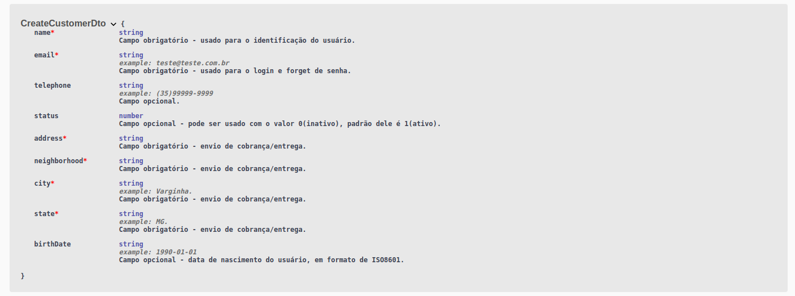
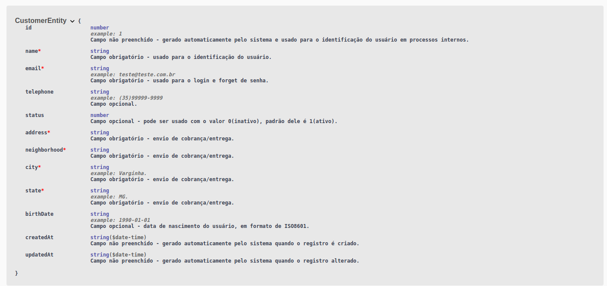
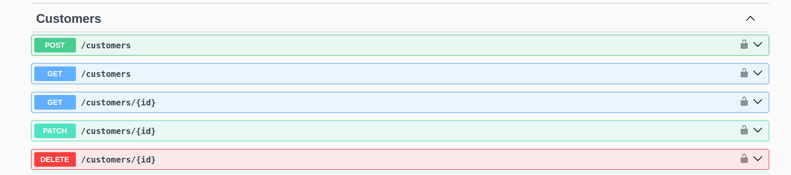
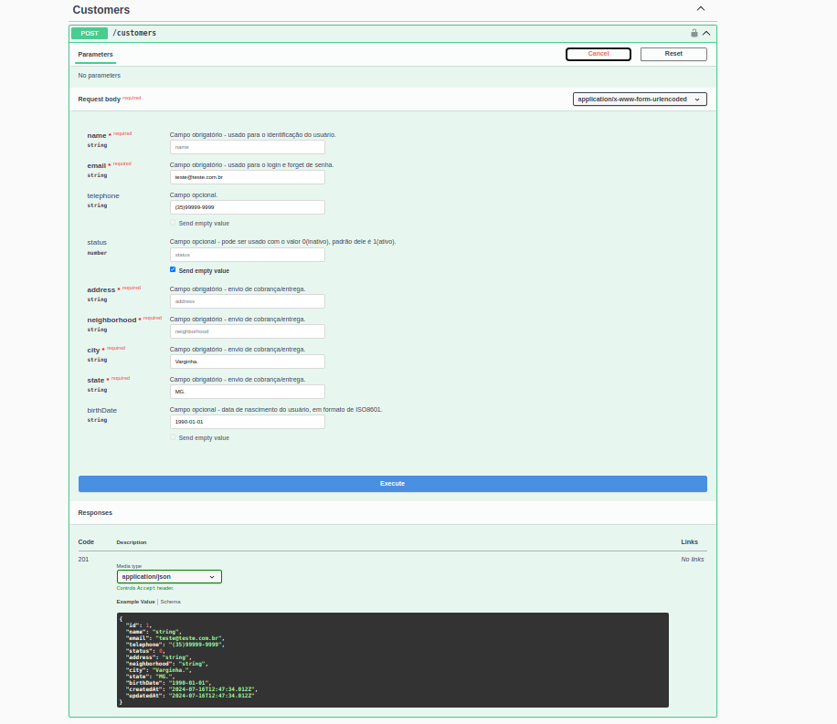

# Controle Estoque

Projeto de controle de estoque, que visa melhorar projeto ja executado em NodeJs e ExpressJs, por um projeto feito em NestJs, melhorando a estrutua do projeto, criando uma estrutura mais organizada.

## Objetivo do projeto

O principal objetivo deste projeto foi a absorção de alguns conhecimentos. Sendo ele o seguinte, fixar oritanção a objetos, a forma de fazer o envio de email, que neste caso estamos tratando com o nodeMailer, banco de dados, sendo inicialmente sendo tratado com o prismaORM e em seguida com o typeORM que se mostrou um ORM mais robusto,
o docker foi outra ferramenta que foi estudada dentro deste projeto,foi usado o swagger para a documentação do api de schemas de DTO e entidades, e finalmente a ferramenta jest para testes: unitários, integração e E2e.

## Problema apresentado

O principal problema proposto pelo app, é fazer um controle simples de compra e venda de produtos, otimizando o gasto com produto par não haver um estoque inflado, bem como não haver falta de produto para venda.

## Tecnologias ultilizadas

- TypeScript
- NodeJs
- NestJs
- Prisma ORM
- Jwt
- Nodemailer
- Bcrypt
- Jest
- Swagger
- Docker
- MySql
- TypeOrm-extensions - ciação de seeds

## Sobre

Apresentando nesta ferramenta o uso de algum recursos como Guards do NestJs, Hash de senhas usando o bcrypt, padrão de acesso por RBAC (Role-based access control). Uso de docker inicialmente para usar o contêiner do Mysql.

## Instalação

Instale projeto com npm

```bash
  npm install
```

## Documentação da API

### Swagger

Toda a documentação sobre endPoint e estrutura de Entities e DTO, estão Localizadas no SWAGGER.
Depois de fazer a instalação e criar o banco de dados, pode-se usar as função das rotas.

```http
  GET /api/docs
```

- DTO Customer.


- Schema da entidade Customer


- Rotas de Crud de Customer.


- Formulário de post do customer configurado no swagger.

